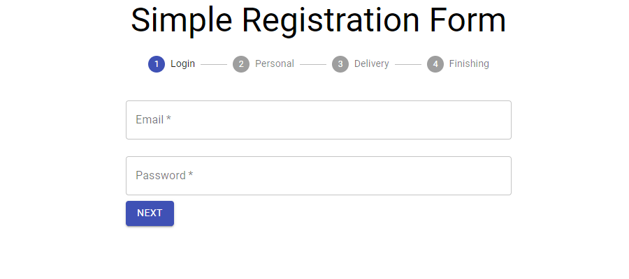

<h1 align="center" style="text-align:center">
<p style="font-family: Bahnschrift Condensed; font-size:35px;">👀 PREVIEW</p>

</h1>

## 📕 Index

- [About](#-about)

- [Technologies](#-technologies)

- [How to download the project](#-how-to-download-the-project)

---

## 📜 About

The **Simple Registration Form** is a **SIMPLE** that was developed with the intuition of learn more about Material UI and ReactJS.

---

## 🚀 Technologies

- [ReactJS](https://reactjs.org/)
- [Material UI](https://material-ui.com/pt/)
- [CSS](https://www.w3schools.com/css/)

---

## 📦 How to download the project

```bash
# Clone the repository

$ git clone https://github.com/harlleybastos/simple-registration-form.git

# Enter in the repository

$ cd simple-registration-form

# Install the dependencies

$ yarn install

# Start the project

$ yarn start

## And done ! :)

```

Developed by Harlley dos Santos Bastos 😁🚀
